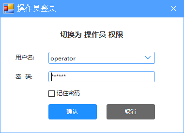
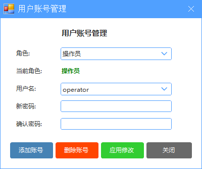
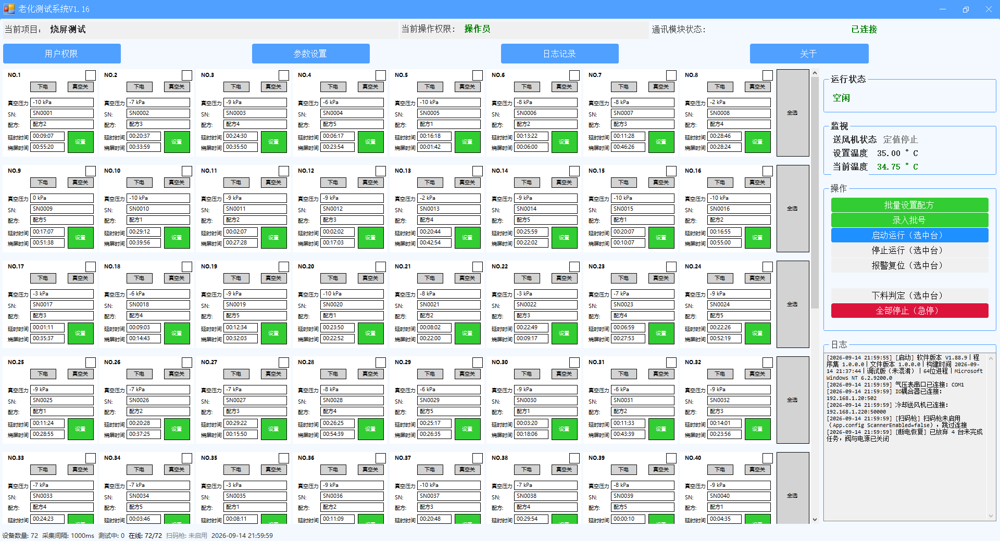
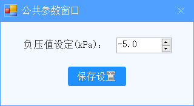
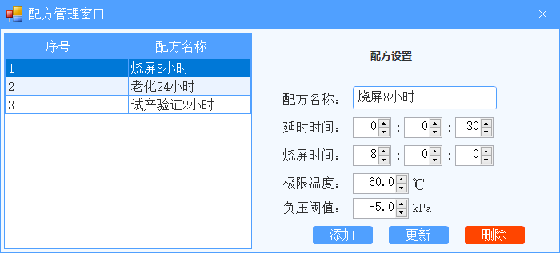
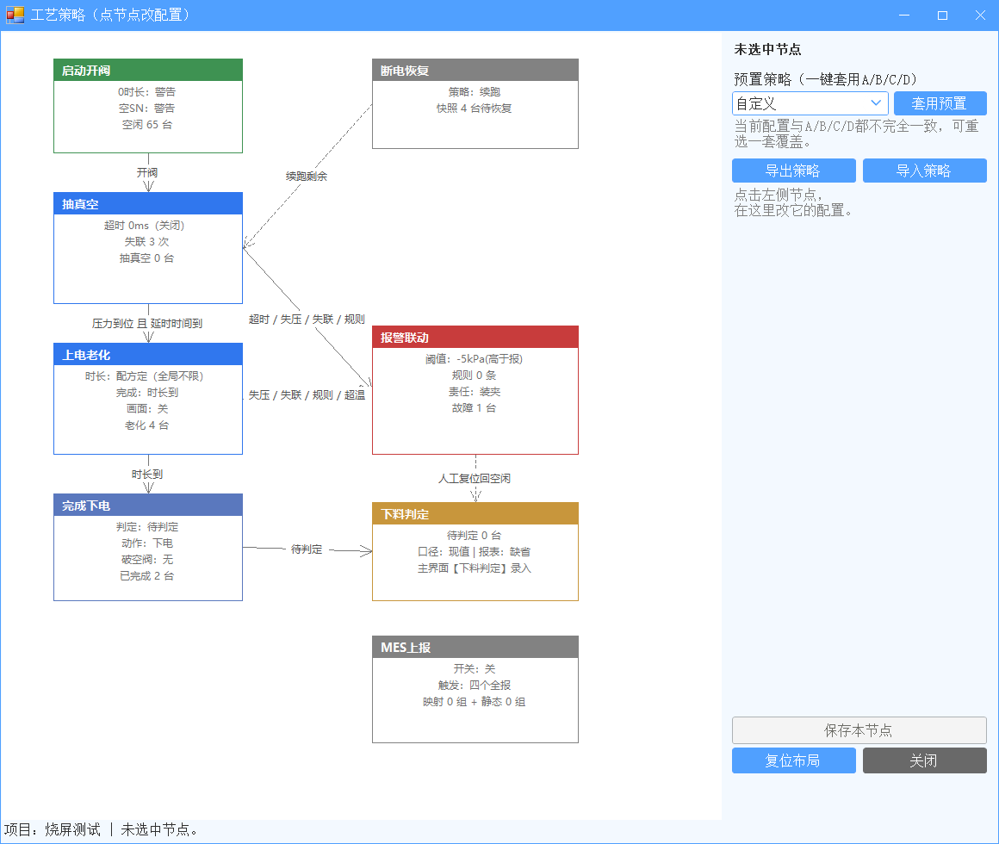
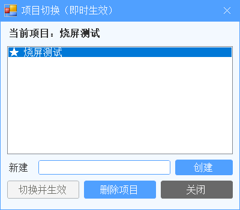
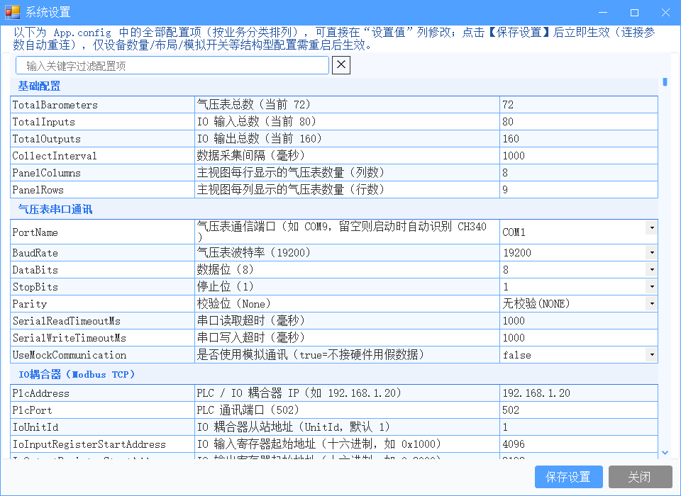
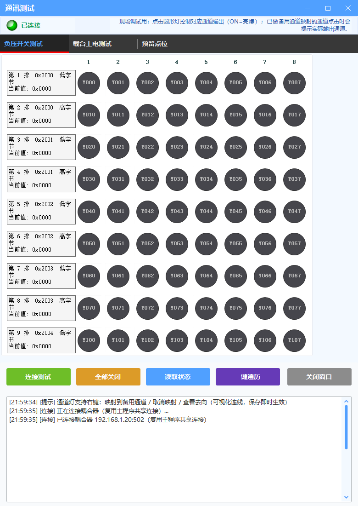
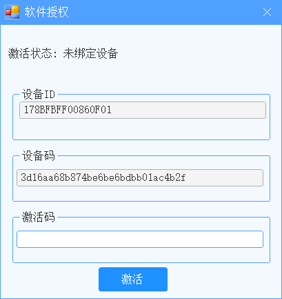

# 老化测试系统 · 内部培训文档

## 一、系统全景（给客户一句话讲清）

- 硬件：72 台真空负压表（Modbus RTU，19200 8N1，从站 1~72）＋ 1 台 IO 耦合器 GX-CL140（Modbus TCP 192.168.1.20:502）＋ 1 台冷却送风机（Modbus TCP 端口 50000）＋ 1 把扫码枪（虚拟串口 115200）。
- 软件：WinForms 单机程序。DeviceManager 是业务编排核心（采集/状态机/报警联动/送风机生命周期）；判定类逻辑收敛在 AgingSequencer 纯函数；配方、工位设置、工艺策略**跟项目走**（`Projects/<项目>/`），用户、快照、日志、连接缓存**跟机器走**（程序目录）；主页布局是纯代码固定值，不跟文件。
- 数据：测试事件记 `Logs\TestLog_yyyyMMdd.csv`（11 列），界面操作记 `Logs\AppLog_yyyyMMdd.log`，MES 上报是后台 POST（失败重试＋离线缓存，永不阻断生产）。

---

## 二、权限体系（先讲权限，再讲功能）

| 角色 | 默认账号/密码 | 功能范围 |
| :--- | :--- | :--- |
| 操作员 | operator / 123456 | 启动/停止/复位/录批号/查历史：日常生产 |
| 技术员 | technician / 123456 | ＋配方管理、公共参数、通讯测试、送风机测试 |
| 管理员 | admin / 123456 | ＋系统设置、用户管理、项目切换、报表列设置 |
| dev（隐藏最高权限） | dev / dev123 | 可删改业务管理员；走"管理员"登录框输入进入，界面无提示；dev 名不可注册、不可改名、不可删除 |

- 用户管理（管理员）：增删操作员/技术员、重置密码。首次交付必须把三个默认密码改掉。
- 交接班只切换账号，不退出软件。
- 记住登录密码是 DPAPI 加密存的，换工控机不跟过去（跟机器）。

---

## 三、主界面与操作区（每个按钮讲清）

- 工位面板区：72 格自绘，状态看面板底色（白＝空闲/浅黄＝测试中/浅粉＝故障/淡钢蓝＝完成待取），再看上电块（绿＝上电）与真空块（绿＝吸住、红＝没吸住、灰＝阀没开）；工作状态文字块已删（V1.88.16，底色＋上下电/真空块已够）。面板 204×140（第一行：编号＋下电＋真空＋选中框同行；下电左缘对齐值框列；延时/烧屏时间值走 9pt 小一号字；V1.95 行内加高：上链间隙各+2、SN→配方交接缝 3→9）。布局纯代码缺省（改布局改代码重编译，不读文件）。
- 选中交互：点右上角选中框（恒正方形，边长跟面板走）或点面板空白即切换选中（单击点选，长按已删）；点面板间缝隙不命中（防触摸误触）。自适应：`AutoFit` 默认开，只剩双向精确铺满一屏（V1.88.24：FitWidth/FitMode 双模式、纵向滚动、拖拽全删；字体下限 4pt（V1.88.21：1280×1024小屏跟随缩小不挤叠）＋正文加粗（V1.88.25 小字清楚），列数 8×9 不动；面板紧凑 204×170（V1.88.17）。顶栏 12 列左右分区（V1.88.24 建、V1.88.26 定稿：AutoSize 列翻车，改"控件全高填充＋列宽代码实测"——六段首选宽＋绘制余量＋各自 Margin，项目列内容封顶 320、长名省略号；状态左、spacer 右、按钮 120 右靠；V1.89 去系统标题栏，最右加最小化/最大化/关闭 3 列 40px，顶栏拖动/双击/边缘缩放走 WndProc）。顶栏行高锁死 30（不可调），10 个控件一律 9pt（按钮与下拉选项字体同源一处调两处跟；选项格按文本实测撑开——主按钮尺寸只当下限，18px 行装 9pt 原生字会裁，实测＋纵向 10px 余量；弹窗 MinimumSize=(1,1) 破 min-track 136 钳制）。每行最右"全选"按钮文字竖排大字（V1.88.28：字号＝正文×2，紧凑一竖块居中；V1.89 列宽 64→48，内容总宽 1736→1720）。清晰度（标题 11pt、设置按钮独立 12pt 大字、时间值 9pt；绿统一深绿 ForestGreen——设置/上电/真空开/选中✓/四窗绿按钮同一色，白字对比度 2:1→4.6:1）。主界面布局纯代码固定：顶栏/状态栏 30，分栏按窗口比例，分隔条锁死鼠标拖不动。
- 右侧操作区 7 个按钮：批量设置配方 / 录入批号 / 启动运行 / 停止运行 / 报警复位 / 下料判定 / 全部停止（急停）。语义见操作员手册，不复述。
- 顶部菜单 4 个：用户权限 / 参数设置 / 日志记录 / 关于。
- 底部状态栏：在线数、采集间隔、测试中台数、扫码枪状态。全部离线标红。
- 右侧监视区：送风机状态与温湿度（缓存显示，零额外报文）。

---

## 四、参数设置下拉（换型配置的主战场）

### 4.1 公共参数：统一写 72 台气压表阈值

- 输入一个 kPa 值，软件同时写两边：气压表设备阈值（0x0010）＋软件报警阈值。
- 72 台逐台写、后台跑，比较慢；失败会给失败名单，照着名单重进再写一遍。
- 注意和操作员强调：**设备阈值 ≠ 软件报警阈值**，但这个窗口是两边一起写的，平时不要乱动。

### 4.2 配方管理：建配方、改配方

- 左边清单、右边编辑，添加/更新/删除自动落盘（无"保存"按钮）。
- 字段：延时时间（时:分:秒）、烧屏时间（时:分:秒）、极限温度、负压阈值、显示模式（仅记录）。
- 配方名只许下拉选（V1.88.13）：批量/工位两窗 `UIComboBox DropDownList`，选项＝配方库名，选中回填参数（工位窗 `_fillingRecipeCombo` 守卫防程序回填误触发）；工位窗脏值追加显示＋保存拦停，选回正常值顺手清脏；比较口径双边 Trim＋忽略大小写；禁引回输入框/自动检索 Provider（手输错名静默回退全局＝串配方）。
- 负压阈值填 0 ＝ 永远"到位"，真空保护形同虚设；老配方升级后显示 0 的必须人工复核。

### 4.3 工艺策略：流程驾驶舱（只讲用法，原理见第六节）

- 拓扑图是画死的（8 节点 8 连线，防误删安全联锁），人人可看；点节点改配置限管理员，保存与系统设置表同一条路。
- 顶部预置 A/B/C 一键套用，出差换型先套：
  - A 标准：量产首试；B 宽松：试产跑起来；C 严格：出货放行（开超温联停，需先填本机超温上限）。
- 右键/滚轮缩放、中键平移、拖节点（位置存本机，不跟项目）。
- MES 上报节点是无连线的纯配置节点，改值走系统设置（与设置表同一条路，见 10.6），改完回节点确认；自定义规则页不是 13 个冻结变量不要手加。

### 4.4 项目切换：换产品/换线

- 仅管理员；在测时禁止切换；切换即时生效不用重启。
- 跟项目走：配方、工位设置、工艺策略；跟机器不动：用户、快照、日志、连接缓存（主页布局纯代码固定）。
- 删项目禁删当前项目；新项目名禁特殊字符、禁穿越路径。

---

## 五、关于下拉（测试与维护窗口）

### 5.1 系统设置：全部配置项（管理员）

- 按业务分类列出 App.config 全部配置项，直接在"设置值"列改，点【保存设置】即生效，连接类自动重连；只有设备数量/布局/模拟开关等结构型需重启。
- 每个配置项悬停有说明（超长自动换行），改之前先看说明里的"现状是什么/改了会怎样"。
- 两类值的写法（配错连不上先查这里）：停止位存 `1`/`15`（=1.5）/`2`，校验位存 `None`/`Odd`/`Even`/`Mark`/`Space`。
- 重点配置速查：`TotalBarometers`（72）、`CollectInterval`（1000ms）、`AlarmPressureThresholdKPa`（-5）、`VacuumConfirmTimeoutMs`（15000）、`CommunicationLossAlarmCount`（3）、`MaxTestDurationSeconds`（0=不限）、`UseMockCommunication`（true=免接线演示）。

### 5.2 通讯测试（IO）：单点点动

- 三页：负压开关测试（真空阀 Y）/ 载台上电测试 / 预留点位。点圆灯＝真动作对应输出（ON=亮绿），先确认阀号再点。
- 【一键遍历】是跑马灯，调试用，生产现场别乱点整排。
- 通道右键可做端口映射（烧通道时把坏通道映射到备用通道，保存即时生效）；预留点来自 IoMapBuilder，不手写。
- 连接复用主程序共享连接，不自建；日志走下方文本框。

### 5.3 送风机测试：定值启停＋温湿度

- IP 默认 192.168.1.220，端口是 **50000**（不是 502）。连不上先查 IP/网线/开关。
- 定值启动/停止、读取状态。测试中有在测工位时不要手动停（会被自动生命周期重启）。
- IP 自动识别：上次成功 IP → 配置 IP → 候选列表，设备换 IP 自动找到。

### 5.4 软件授权：开户与续期

- 与 HJVision 同一套《获取激活码》工具通用。新机无 ini＝新设备，每小时提醒一次，不阻断生产。
- 报码：把"设备ID"和"设备码"报给商务。激活：拿到 30 字符激活码输入点【激活】（错码静默无反应，重输）。
- 两档：永久 / 30 天（768 运行小时格）。过期或新机会置灰"用户权限"按钮，激活成功关窗即恢复（不用重启）。
- 存储：程序目录 `MainSetting.ini [RunHash]`，别删别拷到别的机器（一机一码）。

---

## 六、工艺知识（必须讲到位的 8 条）

1. **三阶段状态机**：启动开阀（延时>0 只开阀抽真空、不带电；延时=0 阀电同开、直接计时并保持常开）→ 真空到位 **且** 距开阀≥配方延时时间 → 自动上电计时 → 到时自动下电关阀（已完成·待取料，蓝）。末台退出在测即自动停送风机（省电）。
2. **参数启动定格**：时长/延时/阈值/SN 在启动瞬间定格，中途改配方只对新启动生效。
3. **配方优先、全局兜底**：三项关键参数先看配方，配方没填回退全局。
4. **0 值语义**：时长 0＝不限时长（永不自动完成）；负压 0＝永远到位（保护失效）；下发 0 就是定格 0，没有"0＝全局"魔法。
5. **报警责任分类**：压力越限/真空建立失败＝产品 FAIL；通讯失联＝设备异常（不冤枉产品）；DI 触点（可选，默认关）；超温联停（可选，默认关）。
6. **完成判定口径**：默认自动 PASS；切"待判定"后完成的台要人工下料录入（PASS/FAIL＋不良代码＋处置，进 CSV）。
7. **断电恢复**：默认整台重测；可配续跑剩余时长（断电期间不计）。重启弹窗二选一：恢复测试 / 放弃并安全关阀断电。
8. **MES 与规则（概念级）**：MES 开关开了没配地址保存即拦；Mock 模式只写 CSV 不真发；联调四步走（拿 5 样→Mock 对格式→开真发→三步排障，见 10.6）；规则变量冻结 13 个、规则只能加严（自定义报警只多报、完成表达式只能提前）；跳过抽真空＝启动即上电（机械夹具，启动大写警告）。

---

## 七、排障手册（现象 → 排查，先查这里再升级）

| 现象 | 先查 | 升级条件 |
| :--- | :--- | :--- |
| 状态栏全部离线标红 | 网线、同网段（IO 192.168.1.20:502）、SP+FP 都有 24V、ST 闪绿＝接触不良 | 线都没问题仍全红 |
| 某台一直通讯失联 | 该表电源/地址拨码/485 A-B/共地；批量写超时＝设备问题 | 换表、换线仍失联 |
| 找不到 CH340 串口 | USB、驱动（VID_1A86/PID_7523）、串口被占用（Access denied） | 换口换线无果 |
| 灯亮软件读 OFF / 写 ON 灯灭 | `InvertInputs`/`InvertOutputs` 置 true（NPN/PNP 差异） | 两边都试过仍反 |
| 压力显示巨大正数 | 小数位/缩放配置（多在换表后）；原始值须有符号解释 | 配置对仍不对，记台号升级 |
| 风机连不上 | 开关/网线/IP（端口 50000）、候选列表；风机是可选设备，不影响开工 | 同网段 ping 不通 |
| 扫码枪扫不出 | 虚拟串口模式、串口占用、ScannerEnabled 开关 | 换枪仍不行 |
| MES 收不到数 | 启动日志 MES 状态行（开了没、往哪发、Mock 还是真发）→ CSV 有无上报行 → `MesQueue.json` 是否长大 | 配置对、网络通、队列不长但 MES 说没有（鉴权/头/schema，对方抓包） |
| 激活码输了没反应 | 错码静默：核对设备码是否本机、30 字符粘全 | 码确认对仍不行 |
| 程序卡顿 | 增大 CollectInterval；确认在后台线程跑 | — |

---

## 八、交付与维护清单

- 交付必做：改默认密码、配好串口/IP、建项目档案、导入配方、首件 2~4 台验证、全开。
- 建项目档案：配方/工位设置/策略跟项目走（`Projects/<项目>/`），用户/快照/日志跟机器；改存储路径先全仓扫字面文件名。
- 日常维护：每班点检 5 项（在线/扫码枪/压力跳动/CSV 可查/激活天数）；`Logs` 定期归档；`MainSetting.ini` 备份好（重装机要重开户）。
- 报修规范：带当天 `AppLog_*.log` ＋ `TestLog_*.csv` ＋ 故障台号 ＋ 面板截图，缺一都慢半天。

---

## 十、核心模块实现思路（技术篇，改代码前必读）

> 目标：知道"逻辑写在哪、为什么写在那、改后缀"。方法名/寄存器/公式都与代码一致，
> 存疑直接 grep 源码，不要背。规范唯一源是根目录 `AGENTS.md`。

### 10.1 业务编排核心 DeviceManager（只做"调用决策＋IO＋日志"）

- 采集：`_collectTimer`（`System.Timers.Timer`，间隔＝`CollectInterval`）每轮调
  `CollectData`：72 台 RTU 轮询压力 ＋ IO 的 DI/DO；送风机独立 2 秒轮询，不阻塞主采集。
  一轮结束一次性触发 `OnBatchDataUpdated(BarometerData[])` 推 UI（避免 72 次跨线程切换；
  BeginInvoke 传数组必须包 `new object[]{arg}`，否则 params 展开炸）。
- 状态机：`StartTesting` 开阀（延时>0 只开阀抽真空、不带电；延时=0 阀电同开直接计时）；`CollectData` 里判
  "真空到位 且 距开阀≥配方延时"→自动上电（老化计时；延时≤0 直接上电，启动回滚重试同口径）；时长到→自动下电关阀
  （Completed 蓝屏）；`StopTesting`＝中止回空闲；`StopAll`＝急停（全关阀＋全断电＋
  停风机＋清任务快照）。
- 报警边沿：`HandleAlarm(deviceId, reason, productRelated, vacuumCause)`，
  进入边沿触发**一次**：关该台阀＋断电＋标 Fault＋写 CSV；
  通讯失联走 `data==null` 分支，`productRelated=false`（不冤枉产品）。
- 送风机生命周期 `UpdateFanLifecycle`：任一在测即运行、全停才停机，
  "只下发一次"状态记忆防重复写；主界面故意没有手动启停按钮。
- 共享连接门面：通讯/送风机测试窗复用 `EnsureIoConnected` /
  `ReadHoldingRegisters` / `ReconnectFan`，不自建 TCP，状态与主界面一致。
- 红线：判定逻辑不许写在这里，一律先进 `AgingSequencer`（下一节）。

### 10.2 判定逻辑唯一归宿 AgingSequencer（纯函数，可单测）

- `ShouldPowerOn`（延时≤0 直接上电；延时>0 才要求压力×延时双条件）、`ShouldComplete`（0＝不限时长）、
  `IsVacuumBuildFailed`（到位即不失败）、`BuildStartBlockText`（阻断文案）、
  `MapAlarmResult`（责任映射）、`ComputeResumeDurationSeconds`（续跑剩余）、
  `ValidatePolicyCombination`（矛盾组合保存即拦）。
- `DeviceManager` 只调这些函数拿结论，然后做 IO＋日志；直接写 UI 层的判定
  单测够不着，复查必搬。改编排先改这里并同步回归用例。

### 10.3 通讯对接（寄存器细节唯一文档是 `docs/通讯接入.md`，这里只讲机制与坑）

- 气压表 RTU：一主多从，`slaveId＝deviceId（1~72）`；读 `0x04 @0x0001`（压力原始值）
  ＋`@0x0002`（小数位；47/72 台回 0 不可靠，生产统一按 `BarometerDefaultDecimalPlaces＝1`）；
  写 `0x06 @0x0010`（设备阈值，单位是设备单位，≠软件 kPa 阈值）。
  换算 `(short)raw / 10^小数位`（必须有符号强转，否则 0xFFFE 变 65534）；
  串口 `_syncRoot` 锁串行化（NModbus 不支持并发）；CH340 用 WMI 按
  VID_1A86/PID_7523 识别 ＋ `BarometerPort.cache` 端口缓存。
- IO 耦合器 TCP：DI 读 `0x04 @0x1000`；DO 读 `0x03` / 写 `0x06 @0x2000`，
  16 点/寄存器。单点写必须**读-改-写**（如 0x2004 低字节＝阀 65~72、
  高字节＝上电 1~8，整字直写误伤）；内部编号↔三菱八进制 `IoMapBuilder`
  （X007 后是 X010）；备用通道只认 `0x00`~`0x0F`（0x10+ 解析层直接拒绝）。
  硬件：SP＋FP 都要供 24V；ST 闪绿＝网线接触不良。
- 送风机：端口 **50000**（不是 502）；状态/温湿度读 `0x03 @0x0000~0x0005`；
  定值启停写 `0x06 @0x0001`；IP 自动识别（上次成功→配置→候选列表）；
  可选设备，连不上不影响整机启动。
- 扫码枪：虚拟串口 115200；WMI 动态搜索识别（拔出 PnP 节点消失即判断连），
  断线心跳静默重连。
- 备用通道映射三层分工：`IoRemapValidator`（新建拦截唯一口：源唯一/目标独占/
  自环/越界，`Serialize` 与 `ParseAll` 互逆）＋`IoRemapCatalog`（点位池唯一口，
  点位来自 `IoMapBuilder` 不手写）＋`IoRemapGraphControl`/`IoRemapVisualForm`
  （只画与选，不管落盘）。执行侧 `MapOutputChannel` 对非法目标保持原通道；
  运行读跟随（按目标寄存器解析，灯＝真值）＋保位掩码（0x2009 多业务共用互不覆盖）。
  保存两条路：通讯窗实时模式＝写 App.config 即时生效；设置表草稿模式＝写回单元格
  等统一保存。目标独占只拦新建，老配置多源同目标照常加载执行。

### 10.4 账号与密码（`UserManager`＋`PasswordHasher`）

- `Users.json` 跟机器、gitignore；密码 PBKDF2-HMAC-SHA256（随机盐＋10 万次迭代，
  `PBKDF2$迭代$盐$哈希` 自描述串），明文永不落盘。
- 对外只吐副本（`CurrentUser`/`GetAccounts` 全 Clone），防拿引用绕过校验改密码；
  记住密码走 DPAPI（MesCrypto 同源），换工控机不跟过去。
- dev 隐藏账号：走管理员登录框进入，界面无提示；可删改业务管理员；
  dev 名注册/改名（大小写变体同样）一律"不可用"；dev 自身禁改名禁删除；
  老文件自愈补 dev（不碰已存密码）。

### 10.5 软件授权加解密（与 HJVision 同源，公式逐字节照抄）

- `Encrypt`＝MD5 取前 15 字节 hex（30 字符）；设备 ID＝WMI 第一块 CPU 的 ProcessorId。
- 设备 ID 码＝`Encrypt(ID+"A")` / 设备码＝`Encrypt(ID+"1")` /
  30 天码＝`Encrypt(设备码+"30")` / 永久码＝`Encrypt(设备码+"ALL")` /
  `RunHash2`＝`Encrypt(ID+i)`（i＝0..839，<768 有效≈30 天）/ 永久标记＝`Encrypt(ID+"ALL")`。
- 设备码恒 "1" 是照抄不是 bug（HJVision 的 currentTime 从没赋值过，Day 恒 "1"），
  不许"顺手修成当天"，否则两边设备码分叉、厂商的码对不上。
- 存储程序目录 `MainSetting.ini [RunHash]` 双键（kernel32 INI API，与 HJVision 同名同结构，
  gitignore）；主窗 `hashTimer` 1 小时一格（永久跳过→命中有效格写下一格→否则过期）；
  新设备/过期只弹框＋置灰用户权限按钮，不阻断启动与生产（V1.88.1 起激活成功关窗即重查解灰）。
- 判定只进 `SoftwareActivation` 纯函数（`VerifyActivationCode`/`FindSlot`/`ComputeStatus`）；
  无密钥无试用无启动闸（MD5 是公开函数，工具流出＝谁都能发码，管好工具）。

### 10.6 MES 对接（映射纯函数＋后台上报器）

- `MesMapping` 是触发器/字段映射/静态字段/自定义头/分地址 vocabulary 唯一出处；
  脏输入保存时拦（报出哪一组错）、上报时跳过（不带病全停）。
- `MesReporter` 后台 POST JSON（鉴权＋重试＋离线缓存 `MesQueue.json`），失败永不阻断生产；
  `Transport` 静态测试缝只许测试赋值，生产走真实 HTTP，用例必须 try/finally 复位。
- 密钥（token/密码）显示解密/保存加密走 `MesCrypto`（DPAPI＋前缀；内存明文、文件密文）；
  自定义头名只认 ASCII（中文在 .NET 里算 Letter 的坑）；
  开关开了没配地址保存即拦；Mock 模式只写 CSV 不真发。
- 现场联调四步（照着走，不用动代码）：①问客户拿 5 样（接收 URL 测试＋正式、
  鉴权三选一、对方样例 JSON、报哪几个事件、特殊头/分地址/常量）；
  ②开 Mock 跑一批，把 CSV 里"MES上报(Mock)"行发对方确认字段；
  ③关 Mock 填真实地址＋鉴权＋映射（触发器/映射/静态跟项目，各客户存各的），再跑一批查收；
  ④收不到走"启动日志状态行 → CSV 有无 → `MesQueue.json` 是否长大"三步（见第七节排障行）。
- 改代码边界（只有这 5 种，其余全是配置）：协议不是 POST JSON / 要第 16 个本站字段
  （vocabulary 冻结 15 个，加字段改 `MesMapping`＋`DeviceManager` 组包＋同步用例）/
  新触发时机（加 `_mes.Report` 埋点）/ 嵌套 JSON 或 XML / 按 MES 返回做业务动作。
- 甩给客户的附件：客户版第七节（自助 7.1~7.7）＋ `docs/通讯接入.md` §7（参数字典），
  两边例子已对齐；客户照着能独立走完 Mock→真发，7.7 兜底"何时找我们"。

### 10.7 规则引擎（手写递归下降，不引脚本引擎）

- `RuleExpr` 沙盒解析求值；变量 vocabulary 冻结 **13 个**（V1.74 加 current，
  老文档写 12 没跟上）：pressure（kPa 实时压力）/ temp（风机温度，离线＝NaN）/
  tempset / hum / device（工位号）/ delaysecs（延时定格秒）/ vacsecs（距开阀秒）/
  agesecs（距上电秒，未上电＝0）/ duration（定格时长秒）/ threshold（定格阈值）/
  di0（DI 触点 0/1）/ hour（0~23）/ current（载台电流，无表＝NaN 只追溯不判定）。
  加变量要同步改组变量＋注释＋说明＋用例四处。
- NaN 比较恒 false（fail-safe，不是 IEEE）；`&&` `||` 短路；规则只能加严不能松绑
  （自定义报警只多报、完成表达式 OR 只能提前、内置联锁动不了）。
- `RuleEngine` 编译缓存＋持续计时（启动/复位/停止/急停必须调 `ResetStation`，
  否则旧计时带到新任务）；解析三防护（表达式内允许 `||` 的切分枚举、
  严格变量模式保存即拦、长度/嵌套上限防栈溢出）。

### 10.8 存储与项目档案（跟项目 vs 跟机器，改路径先背表）

- 跟项目（`Projects/<项目>/`，切项目即换）：配方、工位设置、
  策略 `Policy.json`（`PolicyKeys` 唯一名单，缓存带路径＋长度＋写时间三元指纹防脏读）、
  报表列/显示模式字典。
- 跟机器（程序目录，切项目不动）：用户、任务快照 `TestSession.json`、
  日志 `Logs/`、连接缓存、激活 ini、MES 离线缓存。
  （主页布局/工位面板布局是纯代码固定值，不跟文件。）
- `DeviceConfig` 是 readonly 引用，项目切换走 `CopyFrom` 就地换血（禁换引用）；
  静态缓存（工位设置）切项目必须 Reload；清状态禁调 StopAll（那是急停语义）。
- 运行时 json 一律原子写（临时文件＋同卷改名＋清残留 tmp），禁裸写；
  快照落盘点：启动/上电边沿/完成/报警（加字段先列"哪些变迁写快照"）。

## 十一、掌握要点自查（培训完逐条过，答不上来回炉对应节）

1. 三阶段状态机背下来：启动开阀（延时>0 只开阀，延时=0 阀电同开） → 真空到位＋延时到上电 → 到时自动下电（蓝屏待取料）。
2. 定格/配方优先/0 值语义三条，当场举例说明。
3. 报警四类分清：哪两类记产品 FAIL，哪类只记设备异常。
4. 走一遍换型：切项目 → 建配方 → 首件 → 全开；说出跟项目/跟机器各有哪些文件。
5. 软件授权：报哪两个码、续期几步、过期什么现象、恢复要不要重启（V1.88.1 起关窗即恢复）。
6. 排障：全红离线/单台失联/串口占用/MES 收不到数，各自第一排查动作。
7. 红线：判定逻辑只进 AgingSequencer 纯函数＋同步用例；运行时 json 只走 AtomicFile；新窗打开前 ApplyTo 主题。
8. 背出关键寄存器：压力/阈值/DI/DO/风机各是什么；两种阈值单位差在哪。
9. 说出判定逻辑放哪、DeviceManager 只干哪三件事；加工艺策略 key 走哪套同步清单。
10. 授权公式默写：三件套怎么算、设备码恒 1 为什么、过期什么现象。
11. MES 联调问客户拿 5 样（地址/鉴权/样例 JSON/报哪几个事件/特殊头分地址常量）；失败三步走；规则变量冻结几个、加变量改哪四处。
12. 跟项目/跟机器各举三例；新增持久化先想哪三条。
13. 备用映射：三层各管什么、目标独占拦新建不拦老配置、两条保存路区别。
14. 发混淆包：说出一键脚本名、包与归档各放什么、验收三项看什么（见十二章）。
15. 混淆翻车先查哪：验收 A12 红＝Skip 写法错、B 对账红＝模型名被改、C 冒烟红＝先看 Crash 文件。

---

## 十二、混淆发版操作指南（小白版，手把手，代码就是饭碗）

> 为什么非混淆不可：C# 编译出来的是中间语言（IL），拖进 ILSpy/dnSpy 就是近乎源码，
> 不混淆等于把配方算法、授权公式、工艺策略判定全部送人。混淆主要做两件事：
> 改名（类/方法/变量改成 a/b/c）＋字符串加密（中文提示运行时才解密）。
> 记住两句话：①业务日志记的是中文原文，混淆后照样可读，不怕；
> ②真正怕改名的是"字符串反射找名字"的代码（见 12.6），发版流程就是保住它们。

### 12.1 发版前准备（一分钟清单）

- 代码已是"要发的那一份"（工作区干净最好；实在有未提交改动，脚本会拦，加 `-AllowDirty` 硬发，
  归档里会记下当时改了哪些文件，责任可追溯）。
- 确认版本号：`AgingTestSystem/Services/BuildWatermark.cs` 第一行 `ReleaseLabel`，
   必须和 `CHANGELOG.md` 顶部小节同值（如 V1.88.18），对不上先对上。
- 混淆器：全公司统一用免费开源的 Obfuscar（`Obfuscar.GlobalTool`，命令叫 `obfuscar.console`），
  新电脑跑一次就行（要联网）：
  `dotnet tool install -g Obfuscar.GlobalTool`

### 12.2 方法一（一键脚本，推荐，闭眼用）

在仓库根目录跑（版本号缺省自动读 `ReleaseLabel`，不用手填）：

`powershell -ExecutionPolicy Bypass -File .opencode\skills\agingtest-regression\scripts\obfuscated_release.ps1`

脚本自动做完六步：前置检查 → Release 构建（临时把水印标记翻成混淆版，打完即还原，
日常 Debug 包不受影响）→ 混淆 → 组包 → 三项验收 → 还原校验。
看到 `发版成功 + 验收全过` 才算成，任何一步红字即停（包留着备查，但不许发）。
调试期发联调包在命令后面加 `-DebugPackage`（不混淆、水印标"调试版"、堆栈可读，产物进
`release/<版本>-dbg/`，其余流程一样）。

产物都在 `release/<版本>-obf/`（git 忽略，永不入库）：

- `包/`：拷工控机的全部文件——混淆后的 exe＋依赖 dll＋`exe.config`＋`部署说明.txt`。
  里面没有 pdb、没有源码、没有旧数据（Users/ini/Logs/Projects 一律不进包）。
- `归档/`：内部留底——`Mapping.txt`（改名对照表，客户堆栈反解全靠它）＋`MD5.txt`（包内每个文件哈希，
  客户说"跑起来不对"先对 MD5，看包被动过没有）＋`AgingTestSystem.pdb`＋本次混淆配置＋`版本.txt`
  （版本/打包时间/git 号/当时工作区改动）。

### 12.3 方法二（VS 手动挡，脚本跑不通时才用）

1. VS 顶部工具栏把 `Debug` 切成 `Release`，菜单 生成 → 重新生成解决方案，等输出
   `AgingTestSystem -> ...\bin\Release\AgingTestSystem.exe` 且无 error。
2. 先把水印标记翻成混淆版：打开 `Services/BuildWatermark.cs`，
   把 `IsObfuscatedBuild = false` 改成 `true`，重新生成一次（这一步脚本是自动做的，
   手动别忘；发完必须改回 false，否则以后 Debug 包的水印会谎报混淆版，回归里的"恒 false 锁"会变红提醒你）。
3. 复制 `bin\Release` 全部文件到一个空的输入目录（如 `D:\obf\in`），再建空输出目录（如 `D:\obf\out`）。
4. 复制 `tools/obfuscation/obfuscar.xml` 到 `D:\obf\`，把里面 `InPath`/`OutPath` 两行改成
   上面的绝对路径（Obfuscar 新版只认绝对路径，相对路径直接拒收）。
5. 命令行跑：`obfuscar.console D:\obf\obfuscar.xml`，看到 `Completed` 且输出目录有
   `AgingTestSystem.exe`＋`Mapping.txt` 即成功。
6. 组包：输出目录的混淆 exe＋输入目录的其余 dll/config（删掉 pdb/xml/旧数据）即发客户的包；
   `Mapping.txt`＋pdb＋MD5＋配置＋版本号自己存好（对齐 12.2 的归档五件套）。
7. 验收照 12.4 三项手工过（或直接跑一遍一键脚本，它会自动全验）。

### 12.4 验收三项（脚本自动做，手动发也要看懂输出）

- A 行为验收（12 项全 PASS 才 ACCEPT）：水印含版本号＋"混淆版"字样 / AppLog 中文落盘无乱码 /
  Crash 落盘 / 72 台缺省 / 策略 key 字符串反射全命中 / 配方 JSON 往返 /
  规则解析 / 激活比对 / SetDarkMode 与两窗联想字段反射仍在。
- B 元数据对账（Models 一字不差）：把混淆版和未混淆版的模型清单逐行 diff，
  差一行都不行（Json 存盘和字符串反射全靠这些名字）。
- C 真机冒烟：混淆 exe 真启动 22 秒不退出，AppLog 首行水印含版本＋混淆版，且全程无 Crash 文件。

### 12.5 发客户与留底（照单抓药）

- 发客户：`包/` 整体拷贝（整包覆盖升级，先让客户备份 Logs 与 Projects）。
  附带交代三句：默认密码必须改、激活码一机一码、出问题发回 Logs 文件夹。
- 自己留：`归档/` 按版本号存（Mapping 丢了，客户发回的天书堆栈就永远解不开了）。

### 12.6 红线（违反即返工，和代码红线同级）

- 新增"字符串反射找名字"（`GetProperty`/`GetMethod`/`GetField` 传字面量）必须同步补
  `tools/obfuscation/obfuscar.xml` 的 Skip 行，写法是 `type="类型全名" name="成员名"` 分开写，
  不要写成 `name="类型全名.成员名"`——后者会被静默忽略，字段照改不误，
  验收 A12 就是专门抓这个的（V1.88.10 实测抓到过一次）。
- Models 命名空间整体已跳过（`SkipNamespace`），新建模型类放进 Models 即自动受保护，
  不用补行；但也别把非模型类塞进 Models 凑数。
- `release/` 目录永不入库；`IsObfuscatedBuild` 发完必须回到 false（脚本自动还原，手动挡自己改回）。
- 新增 ps1 脚本必须带 UTF-8 BOM，否则 Win7 工控机常见的 PowerShell 5.1 会把中文解析劈开，
  报一堆看不懂的 ParserError（V1.88.10 实测）。