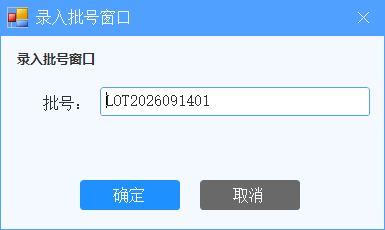
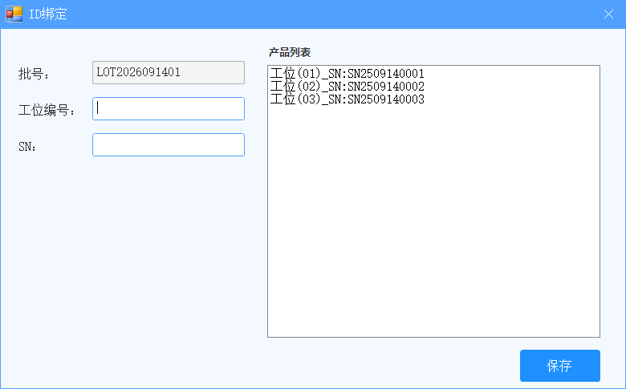
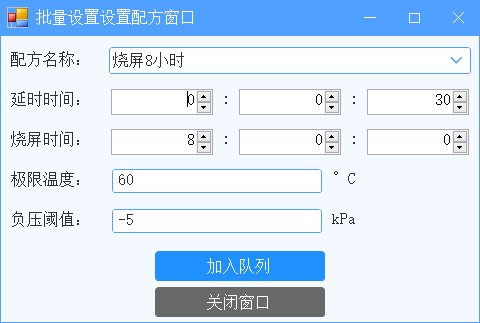
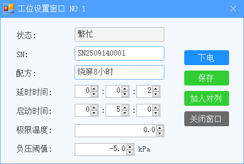
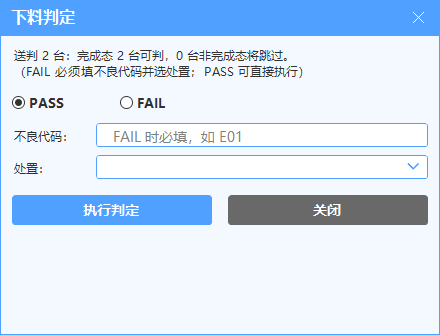
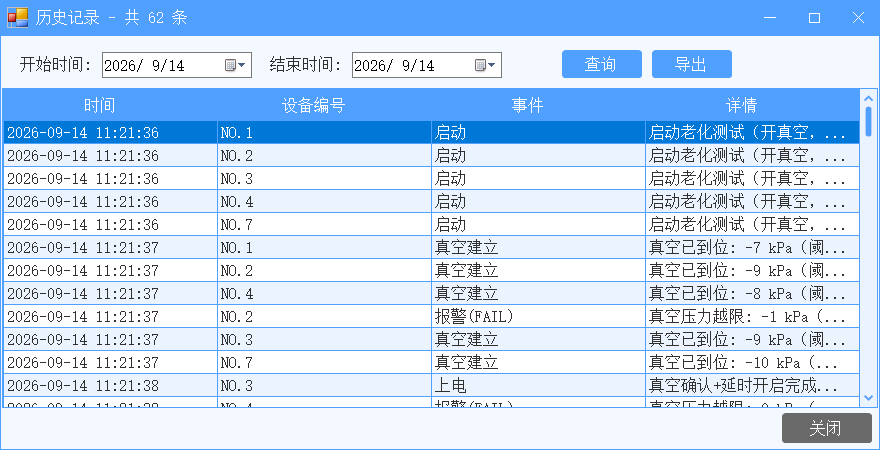
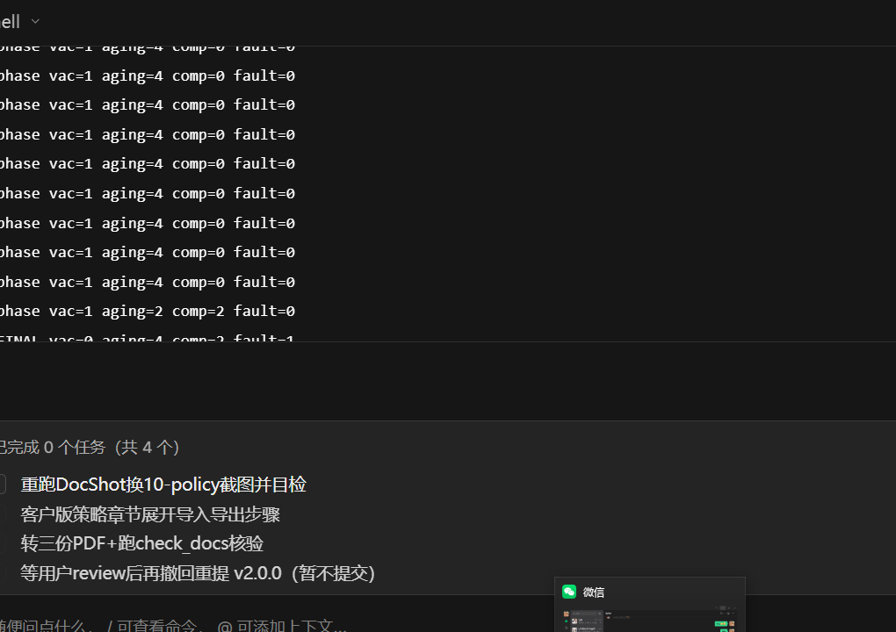

# 老化测试系统 · 客户技术工艺使用说明

## 一、系统组成（盘点一遍，心里有数）

| 硬件 | 规模 | 软件里对应什么 |
| :--- | :---: | :--- |
| 真空负压表 | 72 台 | 主界面 72 个格子，一格一台，显示压力/状态 |
| 真空电磁阀 | 72 路 | 软件自动开关，无手动按钮 |
| 载台电源 | 72 路 | 延时>0：真空吸稳 + 延时到才自动上电；延时=0：阀电同开直接计时 |
| 冷却送风机 | 1 台 | 有在测工位即自动运行，全停才停机 |
| 扫码枪 | 1 把 | 扫产品条码绑定工位 |

软件安装在工控机上，单机运行。配方、工位设置、工艺策略按"项目"存放（换产品/换线时切换项目即可，见 4.4）；测试记录记在 `Logs` 目录（见第七节）。

---

## 二、账号与权限

| 角色 | 默认账号/密码 | 能干什么 |
| :--- | :--- | :--- |
| 操作员 | operator / 123456 | 启动/停止/复位/录批号/查记录：给产线员工用 |
| 技术员 | technician / 123456 | 再多：配方管理、公共参数、通讯测试、送风机测试 |
| 管理员 | admin / 123456 | 再多：系统设置、用户管理、项目切换、报表列设置 |

- 设备交付后请第一时间在【用户权限】→【用户管理】里修改三个默认密码，并按实际人员增删账号。
- 交接班只切换账号，不退出软件。

---

## 三、主界面与操作（带操作员一起认一遍）

- 中间 72 格：状态**看面板底色**：白＝空闲 / 浅黄＝测试中 / 浅粉＝故障 / 淡钢蓝＝已完成·待取料；再看上电块（绿＝上电）与真空块（绿＝吸住、红＝没吸住、灰＝阀没开）。故障格一眼定位。
- 右边"操作"区：批量设置配方 / 录入批号 / 启动运行 / 停止运行 / 报警复位 / 下料判定 / 全部停止（急停）。
- 顶部菜单：用户权限 / 参数设置 / 日志记录 / 关于；底部状态栏看"在线 72/72"（大面积离线先查线缆电源）；右边监视区看送风机状态与温湿度。
- 生产标准流程 8 步：录入批号 → 扫码绑定工位↔SN → 设配方 → 选中工位启动 → 巡检 → 到时自动断电 → 取料 → 复位（蓝/红屏必须点【报警复位】才回空闲，停止键清不掉）。
- 面板选中：点右上角选中框或点空白处即选中，可多选；点缝隙（格子之间的空条）不选中；面板上的【设置】按钮点哪台开哪台单台设置窗（不看选中数），批量改多台走右边【批量设置配方】按钮。
- 自适应显示：72 格刚好铺满一屏（不同显示器即换即铺满，不用上下左右拖滑块；字取窄边等比缩放）；右上角选中框是正方形，点框或点空白处即选中。

- 配方名只能从下拉选已有配方（禁手输，防打错串配方）；选中后延时/烧屏/温度/负压自动回填；选不了就先去【配方管理】建。工位窗回填名若在库中已无（配方被删），会追加显示并在保存时拦停，明示重选。

---

## 四、换型配置清单（换产品/换线时照着打勾）

| 步 | 动作 | 说明 |
| :--- | :--- | :--- |
| 1 | 确认 72 台全空闲 | 在测时禁止切换项目，先停完复位 |
| 2 | 参数设置 → 项目切换 | 仅管理员；点"切换并生效"即时生效，不用重启 |
| 3 | 新产品点"新建" | 起名用产品名/线别（如"XX模组-烧屏"），不用特殊符号 |
| 4 | 建配方并下发 | 见第五节；延时/时长/阈值按新工艺卡填 |
| 5 | 首件验证 | 先开 2~4 台跑一批，看压力、完成时间、记录齐不齐 |
| 6 | 批量投产 | 首件 OK 后再全开；报表列、MES 映射需要就配（见第七节） |

- 切换项目跟着换：配方、工位设置、工艺策略；不换：用户账号、历史日志。
- 删项目不能删当前正在用的；启动时长填 0 会警告（烧屏调试除外，量产必须填时长）。

---

## 五、配方设计方法（工艺核心）

配方 ＝ 一个产品的测试要求：延时时间 ＋ 烧屏时间 ＋ 极限温度 ＋ 负压阈值 ＋ 显示模式（仅记录）。

| 字段 | 怎么定 | 红线 |
| :--- | :--- | :--- |
| 延时时间（时:分:秒） | 开阀后等真空吸稳再上电的时间；看真空建立耗时留余量，一般几十秒；填 0 ＝ 不要等待：阀与电同时开、直接计时并保持常开 | 太短＝没吸稳就带电 |
| 烧屏时间 | 按产品可靠性要求定，烧屏/老化必须填 | 填 0 ＝ 不限时长、永不自动完成 |
| 极限温度 | 按产品规格书上限填 | 超温只报警，不断电（除非开了超温联停） |
| 负压阈值 | 按"多大真空算吸好"填，如 -5kPa | 填 0 ＝ 永远"到位"，真空保护失效 |
| 显示模式 | 只做记录（如常亮/呼吸），不参与判定 | 乱填不影响测试，只影响追溯 |

- 下发：批量窗口填好点【加入队列】＝ 存配方 ＋ 发到选中工位；单台微调点格子里【设置】。
- 定稿验证：先 2~4 台小批量跑一批，确认"时长到自动完成、记录 PASS、CSV 有行"，再全开 72 台。
- 三个铁律：①参数启动瞬间定格，中途改配方只对新启动有效；②配方优先、全局兜底，配方填全；③SN 为空也能启动但无追溯，量产必须扫码绑定。

---

## 六、工艺策略选用（A/B/C 预置 ＋ 驾驶舱）

- 拓扑图画死（8 节点 8 连线，防误删安全联锁），人人可看；点节点改配置要管理员，保存与系统设置同一条路。
- 出差换型先套预置：A 标准（量产首试）/ B 宽松（试产跑起来，误报多切 B）/ C 严格（出货放行；开超温联停前先填本机超温上限）。
- 常用策略含义：0 时长/空 SN 是警告放行还是硬拦截；真空失败记产品 FAIL 还是装夹异常；完成自动 PASS 还是待判定人工录；断电整台重测还是续跑剩余；老化中失压停机报警还是只记事件。
- 缺省＝现状行为，不动就是原来那套；MES 上报节点显示当前映射状态（改值走系统设置，见第七节）；自定义规则页变量是冻结的，不要手加。

---

## 七、记录、报表与 MES 联调

- 日志记录 → 历史记录：按日期查启动/报警/完成/判定全过程；【导出】按"报表列"配置生成 xlsx（找管理员在历史窗"报表列设置"里配列）。
- 交接：主界面下方操作日志框与 `Logs\AppLog_*.log` 逐行一致；报修时把当天 log 和测试 CSV 一起发售后。

### 7.1 MES 自助对接（HTTP POST JSON，改配置就行，不动代码）

- 一句话原理：启动/完成/报警/下料判定四个事件发生时，软件自动往你们 MES 的接收地址 POST 一段 JSON；发失败自动重试、进本机缓存等网络好了补发，**永不阻断生产**。
- 流程驾驶舱里的 MES 上报节点显示当前映射状态（改值走系统设置，改完回节点确认）。

### 7.2 先找 MES 厂方拿 5 样东西

1. 接收 URL（测试环境一个、正式环境一个）。
2. 鉴权方式：None（无）/ Bearer（给一个 token）/ Basic（给用户名＋密码）。
3. 字段对照：他要的键名 ↔ 7.5 本站 15 个字段（先拿他的样例 JSON 最省事）。
4. 报哪些事件：四个全要，还是只要完成＋报警。
5. 特殊要求：要不要自定义头（如产线头）、报警走单独地址、产线/车间常量。

### 7.3 两步走（先对格式，再开真发）

| 步 | 动作 | 在哪配（管理员） | 说明 |
| :--- | :--- | :--- | :--- |
| 1 | 开 Mock 对格式 | 总开关开＋联调 Mock 开 | 不发 HTTP，只写 CSV；跑一批，把 CSV 里"MES上报(Mock)"行的完整 JSON 发 MES 厂方确认字段 |
| 2 | 开真发 | 联调 Mock 关，填真实地址＋鉴权＋映射 | 再跑一批，去 MES 侧查收；收不到走 7.6 |

- 开了总开关没填接收地址，保存时直接拦（防空转，不是 bug）。
- 上线前记得把 Mock 切回关，否则"一切正常但 MES 永远收不到"。

### 7.4 配置字典（关于 → 设置，管理员；改完点保存设置）

| 配置项 | 跟谁走 | 说明/示例 |
| :--- | :--- | :--- |
| 总开关 | 跟机器（这条产线） | 开才上报，默认关 |
| 联调 Mock | 跟机器 | 开＝只写 CSV 不真发；上线前关 |
| 接收地址 | 跟机器 | 完整 URL；开了开关没填保存直接拦 |
| 鉴权方式/Token/用户名/密码 | 跟机器 | None/Bearer/Basic；Token 换工控机要重填（本机加密，拷文件带不走） |
| 超时/重试次数/重试间隔 | 跟机器 | 默认 5000ms / 3 次 / 2000ms，一般不用动 |
| 触发器 | 跟项目（换产品跟着换） | Start 启动 / Complete 完成 / Alarm 报警 / UnloadJudge 下料判定；留空＝四个全报 |
| 字段映射 | 跟项目 | MES名=本站名，分号隔，如 `eqId=device;lotNo=lot`；留空＝用本站原名 |
| 静态字段 | 跟项目 | 键=值，分号隔，如 `line=L5;workshop=A3`；每次上报都带上 |
| 自定义头 | 跟机器 | 头名=头值，如 `X-Line=L5`；头名只认字母数字加 `-_.` |
| 按事件分地址 | 跟机器 | 触发器=URL，如 `Alarm=http://192.168.1.50:8080/api/alarm`；没配的事件回默认地址 |

### 7.5 本站字段表（15 个，照着配映射）

| 本站字段 | 含义 |
| :--- | :--- |
| time | 事件时间 |
| lot | 批号 |
| device | 工位号 |
| event | 事件类型 |
| sn | 产品 SN |
| recipe | 配方名 |
| result | 判定结果 |
| detail | 详情 |
| pressure | 压力 kPa |
| temp | 温度 |
| duration | 时长秒 |
| displayMode | 显示模式 |
| project | 项目名 |
| disposition | 处置 |
| defectCode | 不良代码 |

- 改名是真改名：配了 `eqId=device`，发出去只有 `eqId`、没有 `device`，对方按严格格式收也不会拒。
- 完成事件带时长＋判定结果，报警带压力值，下料判定带不良代码＋处置。

### 7.6 收不到数三步查

1. 看启动日志 MES 状态行：开了没、往哪发、Mock 还是真发（Mock 没关是最常见的"假故障"）。
2. CSV 里有上报行但 MES 说没有 → 查 URL、鉴权、防火墙、自定义头。
3. 程序目录 `MesQueue.json` 一直在长大 → 网络或 MES 侧不通（只有对方回 2xx 才算成功）；通了自动补发，不用手工重发。

### 7.7 什么情况找我们（只有下面这些要改代码，其余自己配）

- MES 不是 HTTP POST JSON（如 SOAP、私有 TCP、消息队列、两步登录拿票）→ 找我们改传输。
- 要第 16 个字段、新触发时机、嵌套 JSON、按 MES 返回做业务动作 → 找我们。
- 7.6 三步都对、网络通、MES 说没收到 → 把当天 log＋CSV＋`MesQueue.json` 一起发我们。

---

## 八、测试与调参窗口（技术员及以上）

| 窗口 | 入口 | 用途 | 注意 |
| :--- | :--- | :--- | :--- |
| 通讯测试(IO) | 关于菜单 | 单点点动输出、读输入、通道遍历、备用通道映射 | 点灯是真动作，确认阀号再点；备用通道只在通道烧毁时用 |
| 送风机测试 | 关于菜单 | 定值启停、看温湿度 | 有在测工位时不要手动停，会被自动重启；全停维护时用 |
| 公共参数 | 参数设置菜单 | 统一写 72 台气压表阈值（设备 0x0010 ＋软件阈值两边一起） | 逐台写较慢后台跑；失败名单照单重写一遍 |

### 备用通道映射：某路输出烧了，不用换模块不停产

- 什么情况下用：某一路输出通道烧了（灯不亮或常亮），其它都正常。
  把这路信号"搬"到预留备用通道上，生产不停。
- 开法：通讯测试窗里找到坏的那路灯 → 右键 →【映射到备用通道…】
  （源已自动预选）→ 在连线页右侧点一个空闲的备用目标 → 出蓝色连线 →
  左上【启用备用通道映射】打勾 → 点【保存】即时生效。
  右键【打开端口映射配置…】看全图总览；【查看映射去向】查某路搬到哪了。
- 连线页操作：左点源（变蓝）→ 右点目标；点连线选中（变红），右键或
  【删除选中】删；【清空全部】要二次确认；下方清单与连线一一对应。
- 三条铁律：①一个备用目标只接一个源（独占，占用显示"已板XX占用"）；
  ②左上启用开关必须打勾（配了不开＝存了用不上，保存时会提醒你）；
  ③从通讯窗进保存即时生效，从设置表映射行进的是草稿，还要点设置表保存。
- 验证：回通讯窗点该通道灯 → 弹悬浮提示"实际输出是 X"，灯态按真值显示。
- 取消：右键该通道 →【取消本通道映射】（只删这一条，开关不动）。
- 格式：源/目标通道只认 0x00~0x0F（0x10 以上拒绝）；文本写法
  `0x2000@0x00->0x2009@0x00`（源寄存器@通道 → 备用寄存器@通道）。

---

## 九、系统设置与软件授权

- 关于 → 设置（管理员）：全部配置项按分类编辑；每项悬停有说明，改前先看；
  顶部有搜索框，直接输名字定位；改完点【保存设置】，连接类自动重连，
  只有弹窗提示重启的才重启。
- 分类逐个讲（括号里是能动什么、别碰什么）：
  - 基础配置：设备数量 72、采集间隔 1000ms、面板行列。改数量/行列要重启。
  - 气压表串口通讯：端口留空自动识别 CH340；波特率 19200、8N1 别动；
    Mock 开关 true＝不接硬件跑演示，现场必须是 false。
  - IO 耦合器：IP 192.168.1.20、端口 502、从站 1；寄存器地址别动；
    灯亮软件读反时改输入/输出取反；备用映射开关＋映射串见第八节备用通道映射。
  - 气压表寄存器：压力地址 0x0001 别动；小数位 1（换表才按表核对）；缩放默认 1。
  - 冷却送风机：启用开关；IP 192.168.1.220、端口 50000；候选 IP（设备换 IP 自动找）；超时。
  - 报警与业务：软件报警阈值（默认 -5kPa，只判报警不写设备）；
    失联几次报警（默认 3 次）；老化最大时长（0＝不限）；DI 触点默认关；
    超温上限 0＝不启用、联停开关默认关。
  - 工艺策略：10 项下拉（中文显示、英文存储）；矛盾组合保存时直接拦，按提示改。
  - 规则流程：跳过抽真空（机械夹具才开）、完成表达式、自定义报警规则
    （变量冻结、规则只能加严：报警只多报、完成只能提前）。
  - MES 对接：总开关、接收 URL、鉴权、重试次数；触发器/字段映射/静态字段（完整自助见第七节）；
    开关开了没配地址保存会被拦。
  - 报表导出：点出表格弹窗配列（显示名＋字段下拉，可增删/上下移）；留空＝缺省列。
  - 显示模式字典：开关（默认关，三窗隐藏该行）＋字典选项。
  - 扫码枪：启用、留空自动识别、115200；扫不出先看这里开没开。
  - 载台电流：总开关（默认关；开了面板多一"电流"行）。
- 用户管理（用户权限 → 用户管理，管理员）：选角色 → 填用户名 → 设密码 →
  【添加账号】；选中已有账号可改密/【删除账号】；人员离职即删；
  初始 123456 交付即改。
- 报表列设置：历史窗【导出】旁按钮（管理员）→ 显示名文本＋字段下拉 →
  增删/上下移 → 确定；换了项目重配（跟项目走）。
- 工艺策略改配置：参数设置 → 工艺策略 → 点节点 → 右侧改值 →【保存节点】；
  先套 A/B/C 预置再微调；MES 节点显示映射状态，改值走系统设置（见第七节）。
- 通讯配错连不上先查：串口（CH340 自动识别）、波特率 19200、IO 地址 192.168.1.20:502、送风机端口 50000。

- 新机先联系商务开户，否则每小时提醒一次（不拦生产）。
- 报码：把"设备ID"和"设备码"报给商务（上图是演示机示例，贵机以实际显示为准）。
- 激活：拿到激活码后在同一窗口输入点【激活】；永久显示"永久使用"，30 天显示剩余天数；错码输了没反应，核对 30 个字符重输。
- 过期或新机会置灰"用户权限"按钮，续期/激活成功关窗即恢复，不用重启。
- 程序目录的 `MainSetting.ini` 是本机激活文件，别删、别拷到别的机器（一机一码）。

---

## 十、报警判断与排障

| 现象 | 先查 | 什么情况联系售后 |
| :--- | :--- | :--- |
| 某台压力越限/真空建立失败 | 气管松/漏/产品没放好；批量出现查气源总阀 | 处理复位后仍反复报 |
| 某台一直通讯失联 | 该表电源/地址拨码/485 A-B/共地 | 换表换线仍失联 |
| 状态栏全部离线 | 网线/同网段/IO 供 24V | 线都没问题仍全红 |
| 找不到 CH340 串口 | USB/驱动/串口占用 | 换口换线无果 |
| 风机连不上 | 开关/网线/IP（端口是 50000，不是 502） | 同网段 ping 不通 |
| MES 收不到数 | 启动日志 MES 状态行（开了没/往哪发/Mock 还是真发） | 配置网络都对仍收不到 |

- 合格口径：全程无报警 ＝ PASS；通讯失联记设备异常，不冤枉产品。
- 急停（全部停止）会清任务快照，非紧急不用；断电重启后按提示选整台重测或放弃。

---

## 十一、掌握要点自查（培训完逐条过）

1. 说出 72 格底色含义（白/浅黄/浅粉/淡钢蓝），红/蓝屏用什么按钮清。
2. 独立走一遍换型清单：切项目 → 建配方 → 首件 2~4 台 → 全开。
3. 独立定一个配方：延时/时长/阈值各是什么、红线是什么。
4. 查一次历史记录并导出 xlsx；找到当天 log 文件。
5. 报出设备ID/设备码，说清激活三步。
6. 背出升级条件：哪些自己处理，哪些必须叫售后。
7. 独立走一遍备用映射：右键开连线页 → 连一条 → 开开关保存 → 回通讯窗点灯验证。
8. 说出系统设置里改完哪类要重启，哪类保存即生效。